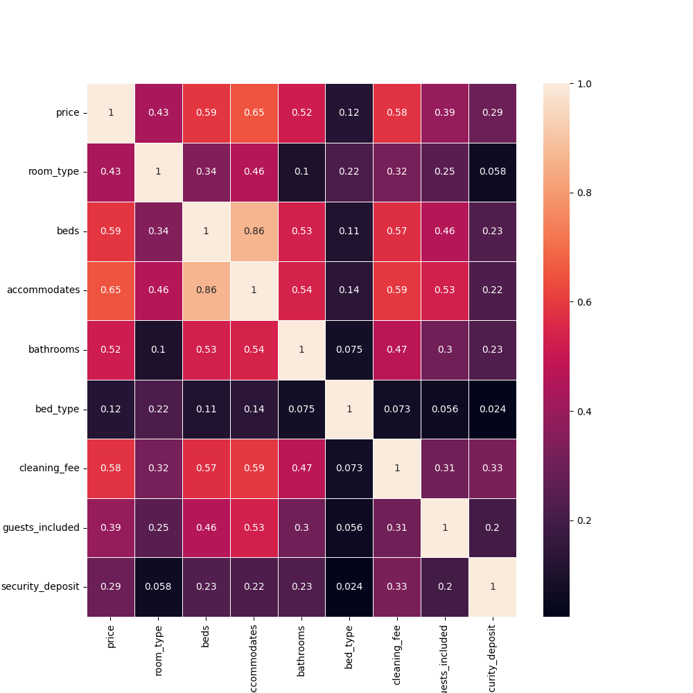

# ReemAlessa.github.io
## Introduction

  There are various views about things to consider while making travel reservations, particularly regarding cost. Individuals typically argue over which season, area or accommodations affect costs the most.
  
It's possible that you've heard remarks like "winter travel is more affordable" or "for a better experience, book in an upscale neighborhood."

When it comes to planning a trip and choosing a destination, we are all different. Examining the data, however, may cause us to rethink our assumptions about what travelers typically like to see and how it affects the market and rental rates.

Therefore, I used data from Seattle Airbnb 2016-2017 open data, to take a closer look at these questions. 

The data provided by Airbnb from 2016–04–04 to 2017–01–02 includes:

•	Listings, including full descriptions and average review score.

•	Reviews, including unique id for each reviewer and detailed comments.

•	Calendar, including listing id and the price and availability for that day.

  

## Part I: What is the busiest time of the year to visit Seattle? by how much do prices spike?

But the query that piqued my curiosity the most was: What would be the ideal time of year to visit Seattle if you wanted to vacation there without having to deal with the crowds? And how much would you save?

The 2016 calendar and the total number of reservations for each month are shown here. January and July would undoubtedly be the busiest months of the year. 

   
  Figure 1: Bookings per Month

It is evident that most individuals would rather travel during the summer (June, July, and August) than during any other season of the year.
Here you can see that prices also tend to spike greatly in the summer, and it reaches its cheapest during January and February. 

   
  Figure 2: Price per Month

We may draw the conclusion that while summer travel is the most popular time for travelers to visit Seattle, winter travel is also very popular because of the low cost of living.

## Part II: What is the most expensive neighborhood in Seattle and what is the one with the highest review scores?

I was curious to see if reservations in a particular Seattle neighborhood would be more expensive or more difficult to come by, as indicated by the graphs below.

   
  Figure 3: Price per Neighborhood

   
  Figure 4: Review Scores Rating per Neighborhood

The first question I asked here was, “What is the most expensive neighborhood in Seattle?”. You can see in the graph below that Magnolia by far is the most expensive one, along with Queen Anne and Downtown. 

The second question was, “What is the neighborhood with the highest review scores in Seattle?”. This illustrates that while certain neighborhoods may have higher prices, the neighborhood of the reserved space has no bearing on the overall experience. 

## Part III: What is the feature that has the biggest effect on the price?

Lastly, I wondered if there might be one or more features that have the biggest influence on the price. 

To investigate further, I cleaned the data to create a correlation map for each feature with the other.

   
  Figure 5: Correlation map

Here, you can see that the features that have the biggest influence on the price are the type of room, the number of people it can accommodate, the number of bathrooms, bedrooms, and beds.

Also, whether the rented space has a cleaning fee or not significantly increases the price.

## Conclusion

In this article, we discussed what to look for when booking a space in Seattle according to Seattle Airbnb open data.

We first looked at how booking prices might differ according to the month. After that, we examined how costs often vary by neighborhood. Finally, we looked at the correlation between prices and different features. We discovered that when a facility can accommodate more people, the prices increase.

These are not the conclusions of a scientific study, but rather observational findings. So, the real question remains:

**What will you look for when booking?**

To see more about this analysis, see the link to my GitHub available [here](https://github.com/ReemAlessa1/Airbnb_data).

